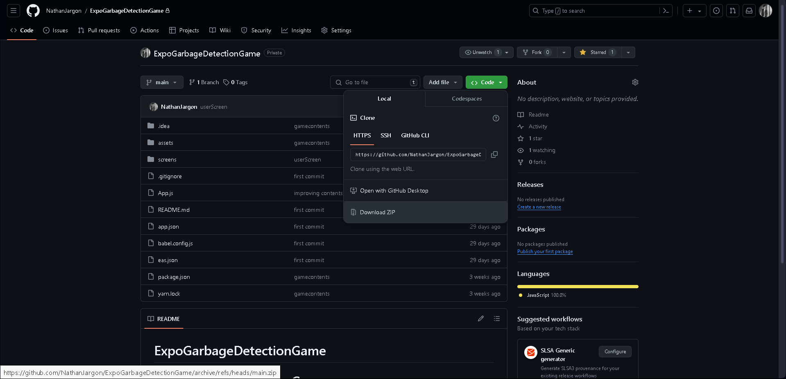
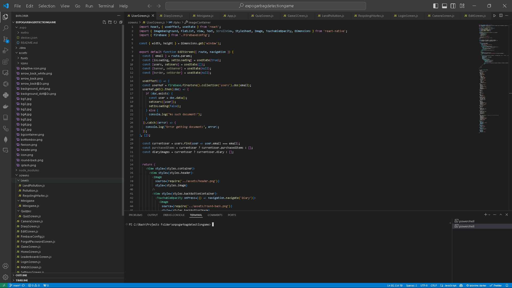
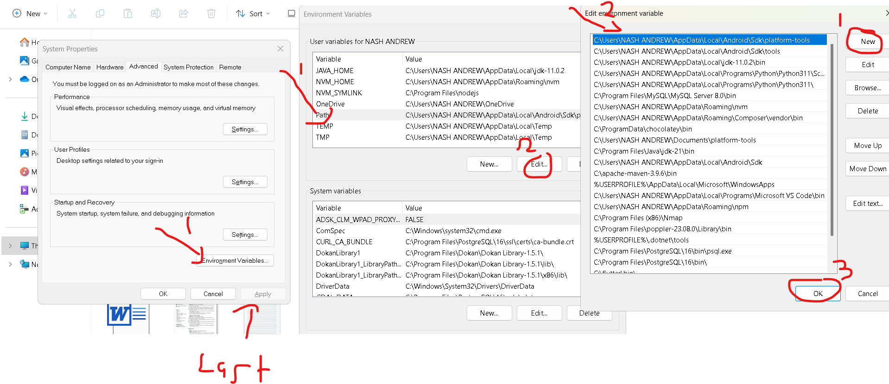
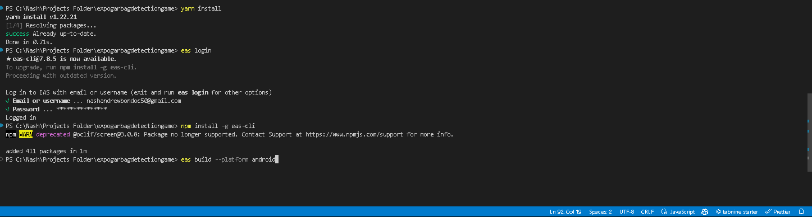

# ExpoGarbageDetectionGame

# Steps on building the project

## Download and Install Visual Studio Code

1. Visit the Visual Studio Code download page and download the version suitable for your operating system.
```https://code.visualstudio.com```
2. Install Visual Studio Code by following the instructions provided by the installer.

## Install Node.js and npm

1. Visit the Node.js download page and download the version suitable for your operating system. 
```https://nodejs.org/en```

2. Install Node.js and npm by following the instructions provided by the installer.

## Install Expo CLI

1. Open your terminal and run the following command to install Expo CLI globally:
```npm install -g expo-cli```

## Main - Clone Your Project

```git clone https://github.com/NathanJargon/ExpoGarbageDetectionGame```

## Alternative

1. On the github repository, download the zip file.



## Install Project Dependencies    

1. Navigate into your project directory



2. Set Up Environment Variables



## Install EAS CLI

1. Run the following command to install EAS CLI globally:
```npm install -g eas-cli```

2. Log In to Your Expo Account
 - Run the following command and follow the prompts to log in to your Expo account:
```eas login```

## Build Your Project
```eas build --platform android```



- Once the build is complete, you'll receive a URL where you can download your APK.
